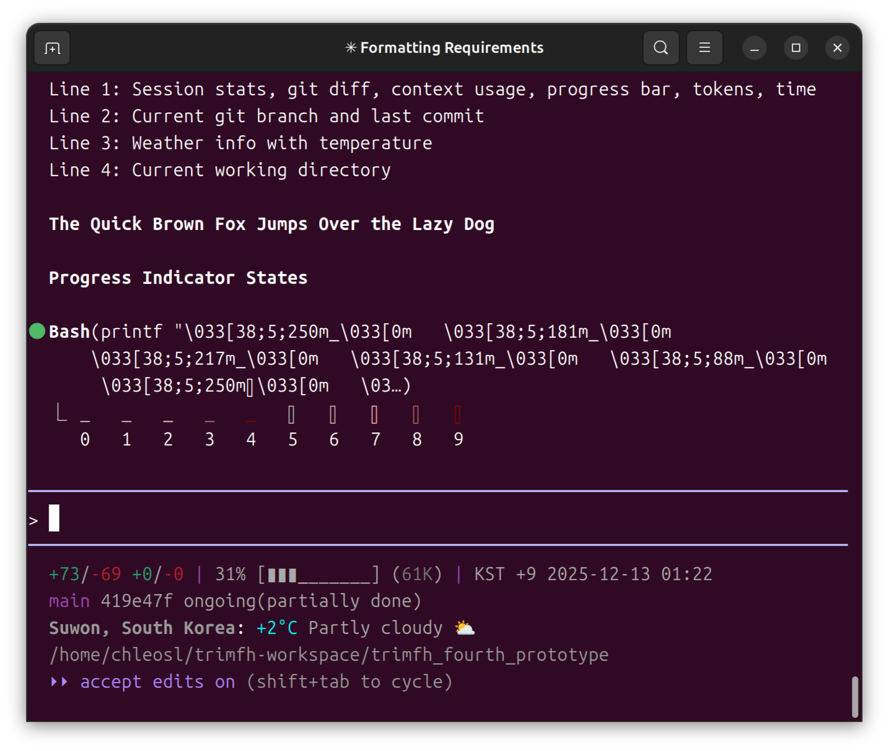
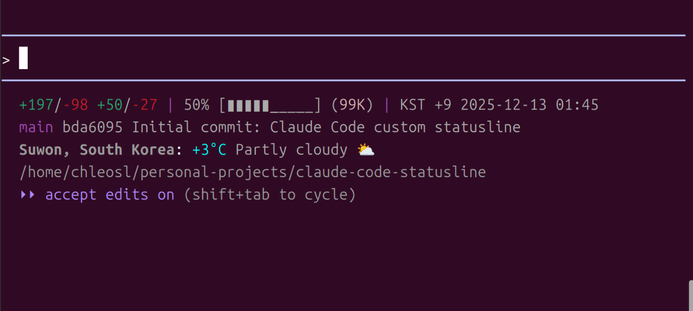
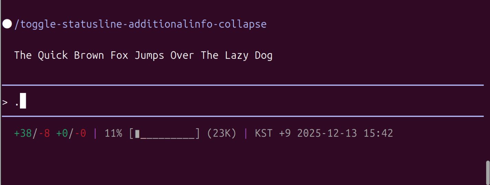

# Claude Code Statusline

Custom statusline for Claude Code CLI.

## Features

- Session stats (lines added/removed)
- Git diff stats (unstaged + staged changes)
- Context window usage with gradient progress bar
- Token count with color coding
- Current git branch and last commit
- Weather info with temperature-based coloring
- Current time with timezone

## Output Format

```
Line 1: +added/-removed (session) +added/-removed (git) | usage% [progress] (tokens) | time
Line 2: branch last_commit_hash last_commit_message
Line 3: location: temp condition icon
Line 4: current_working_directory
```

## Installation

```bash
/plugin marketplace add chleosl/claude-code-statusline-chleosl
/plugin install claude-code-statusline@claude-code-statusline-chleosl
/setup-chleosl-statusline
```

## Image




You can Hide the below three lines and show exclusively-only the top line, by

```bash
/toggle-statusline-additionalinfo-collapse
```


